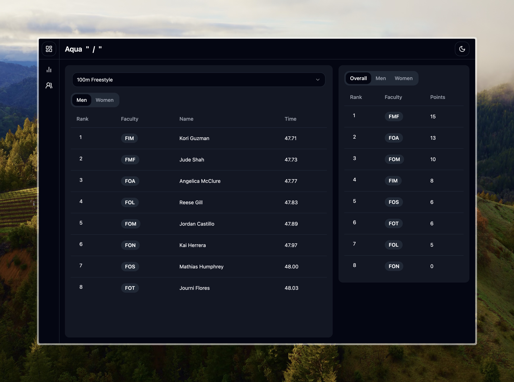
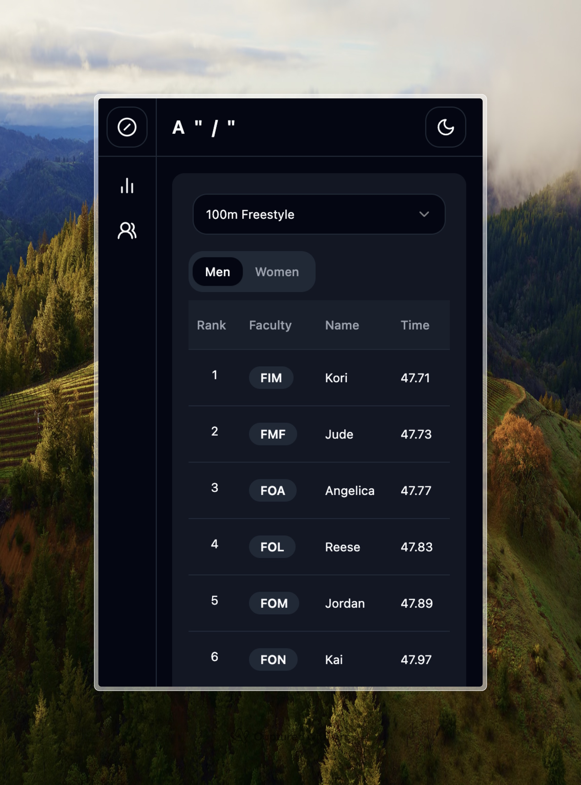

# Aqua Slash

## Description

The Interfaculty Swimming Meet Leaderboard is an online platform designed to track and display the results of the swimming competitions held within the University of Colombo. It provides an easy-to-access and up-to-date leaderboard for participants, coaches, and spectators to follow the progress of the meet.

## Table of Contents

- [Features](#features)
- [Technologies Used](#technologies-used)
- [Installation](#installation)

## Features

- **Real-time Leaderboard**: Displays current standings and results of the swimming competitions.
  
- **Responsive Design**: Accessible on desktop, tablet, and mobile devices.
  
  


## Technologies Used

- Frontend:
  - HTML5
  - CSS3
  - JavaScript (Next.js)
- Backend:
  - Node.js
  - GoogleSheets
- Deployment:
  - Vercel
- Other:
  - Git
  - GitHub

## Installation

1. Clone the repository:

```bash
git clone https://github.com/yourusername/interfaculty-swimming-meet-leaderboard.git
```

2. Navigate to the project directory:

```bash
cd interfaculty-swimming-meet-leaderboard
```

4. Install dependencies:
   
```bash
npm install
```

6. Start the development server:

```bash
npm start
```
